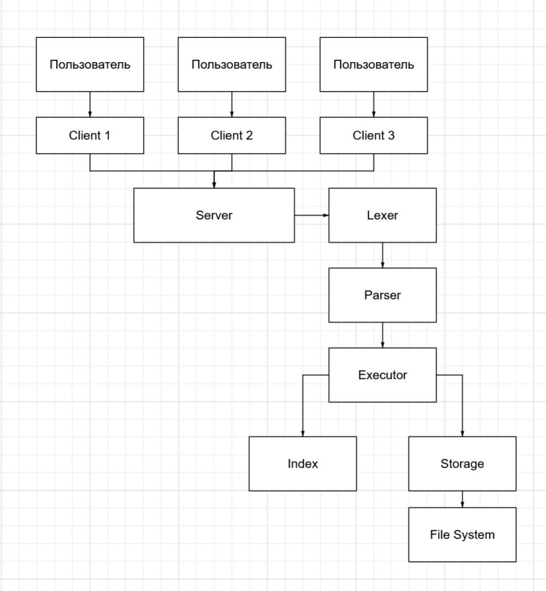

# DBMS_Project_SP

Курсовой проект: учебная СУБД (C++17) с парсером SQL, хранилищем на диске, B\*+-индексом, исполнителем запросов и TCP-клиентом/сервером.

## Описание проекта
В проекте реализована СУБД с SQL-подобным языком запросов.  
Особенности реализации:
- Для индекса используется B*+-дерево;
- Реализована клиент-серверная архитектура с использованием Boost.Asio;
- Реализован логгер запросов;

Схема работы:


## Требования

- C++17, CMake 3.16+
- Boost (system, container)
- Linux или WSL (сборка и демо ориентированы на bash)

## Сборка

Из корня репозитория:

```bash
cmake -S . -B build
cmake --build build -j4
```

Цели: `server`, `client`, unit-тесты модулей.

## Запуск

```bash
./build/server/server <port> [data_dir]   # data_dir по умолчанию: ./data
./build/client/client <port> [script.sql]  # интерактивно или пакет SQL
```

Клиент для DDL/DML ждёт завершения async-запросов (`GET RESULT`). SELECT выполняется синхронно, ответ — JSON.

## Тесты

```bash
ctest --test-dir build --output-on-failure -R ExecutorTests
ctest --test-dir build --output-on-failure -R StorageTests
ctest --test-dir build --output-on-failure -R ParserTests
```

## Демонстрация

Сценарии SQL и пошаговый прогон: [demo/README.md](demo/README.md).

Пример DDL (модификатор колонки — один токен `NOT_NULL`):

```sql
CREATE TABLE users (id INT NOT_NULL INDEXED, name STRING NOT_NULL);
```

## Структура репозитория

| Каталог | Назначение |
|---------|------------|
| `server/parser` | Лексер и парсер SQL |
| `storage` | БД, таблицы, персистентность |
| `index` | B\*+-дерево для INDEXED-колонок |
| `executor` | Исполнение запросов, async-очередь, JSON-ответы |
| `server` | TCP-сервер (Boost.Asio) |
| `client` | TCP-клиент и `sendAndWait` |
| `demo` | SQL-скрипты и `run_demo.sh` |

## Авторы
Бахшалиев М.А.  
Кукава И.Г.  
Мутагиров Т.Р.  
Отмахов Н.А.
